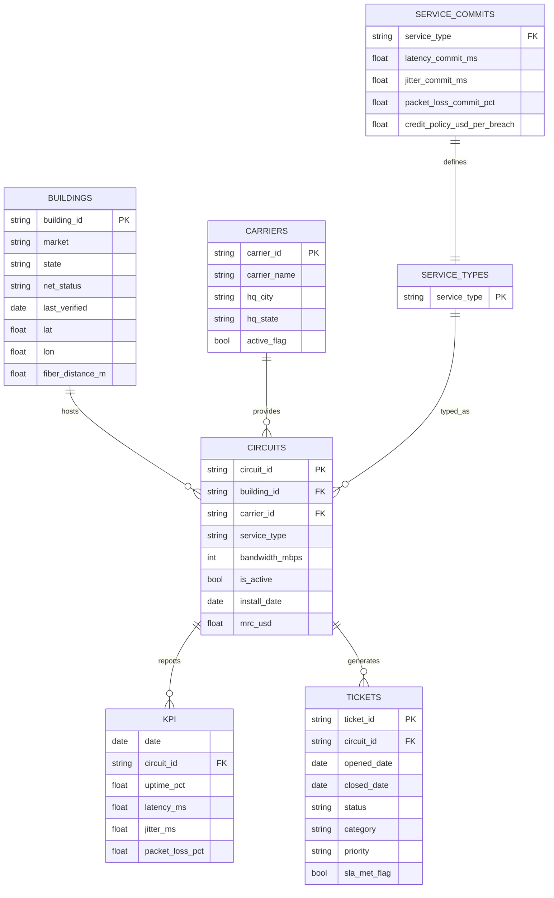

# 📶 Telecom Network KPI & Data Quality (Excel Project)

---

## 🧭 Overview

This Excel-first project simulates a **Network Data Analyst II** workflow in the telecom industry:

- Maintain an accurate **ON_NET / NEAR_NET** building list for future sales opportunities.  
- Monitor **30-day performance** using OcularIP-style KPIs (*uptime %, latency ms, jitter ms, packet loss %*).  
- Quantify **SLA breaches**, estimate **credit exposure**, and rank financial impact by **MRC (USD)**.  
- Build **repeatable Power Query + PivotTable** pipelines with **7 dashboards** for exec-ready insights.  

📂 **Artifacts**
- `/reports/telecom_network_kpi_analysis_v1.0.xlsx` → 21 worksheets  
- `/viz/` → exported charts (coverage, KPI 30 d, credits, tickets)  
- `/docs/` → insights + methods  

---

## ⚡ Quickstart

1️⃣ Open the workbook  

2️⃣ In Excel  
- Enable **Power Query** refresh if prompted.  
- Use **slicers** to filter by *market / carrier / service_type*.  
- Start with `viz_exec` (one-pager) → then `viz_credits`, `viz_kpi_30d`, `viz_tickets`.  

💡 All long sheets have **freeze panes** and named ranges for consistent refresh.

---

  
  
  
  

## 🧭 Mini ERD (Schema Overview)

This diagram shows how the five primary CSVs (plus an SLA commit lookup) relate in the workbook.

## 🎯 Project Objectives & Context  

This project recreates the **daily analytics workflow** of a **Network Data Analyst II** at a telecom company such as Segra — a role responsible for validating network coverage data, tracking SLA performance, and quantifying financial exposure from SLA breaches.  

### **Core Objectives**  
1. **Data Accuracy:** Verify the ON_NET / NEAR_NET building list ( > 500 k records in production ) for duplicates, orphan keys, and outdated entries.  
2. **Performance Monitoring:** Aggregate OcularIP-style metrics (*uptime %*, *latency ms*, *jitter ms*, *packet loss %*) to assess network stability by market and carrier.  
3. **Financial Accountability:** Estimate monthly SLA credits using contract thresholds + MRC (USD) exposure, helping reduce carrier credit payouts.  
4. **Operational Alignment:** Connect ticket categories with SLA breaches to pinpoint recurring root causes.  
5. **Repeatable Workflow:** Build a refreshable, **Excel (Power Query + PivotTables)** pipeline that scales to large CSVs without migrating to SQL or Power BI.  

### **Business Context**  
Telecom operators like Segra manage enterprise and carrier clients through ON_NET / NEAR_NET fiber footprints.  
Each SLA breach produces a **credit liability** and potential **customer churn risk**.  
By monitoring these metrics and maintaining clean network data, analysts directly drive both **revenue growth** and **cost savings**.  

> 🧮 **Protect revenue through SLA tracking** + 🌐 **Drive sales through clean ON_NET data**

---

## ⚙️ Methodology & Workflow (Phases 0 – 7)  

The workflow mirrors a mini ETL pipeline inside Excel — from raw CSVs to insights and dashboards.  

| **Phase #** | **Stage Name** | **Description / Key Actions** | **Output Sheet(s)** |
|:--:|:--|:--|:--|
| **0** | 🧾 Setup & Import | Load five CSVs (`buildings`, `circuits`, `carriers`, `ocularip_kpis`, `tts_tickets`) via Power Query and define data types / keys. | Raw tables |
| **1** | 🔍 Data Quality Checks | Identify duplicates, orphan foreign keys, and stale verifications (`> 365 days`). | `checks` |
| **2** | 🏗️ Coverage & Inventory | Summarize ON_NET vs NEAR_NET buildings; active circuits and MRC by carrier & service type. | `pvt_services`, `pvt_coverage` |
| **3** | 📊 SLA Fact Build | Join KPIs + Circuits + Commits → compute `_fail` flags for latency, jitter, loss. | `tbl_sla` |
| **4** | 💸 Credit Exposure | Apply credit policy (`credit_day = IF(any_fail, rate × mrc_usd, 0)`) and aggregate by carrier & market. | `tbl_sla_facts_final`, `pvt_credit` |
| **5** | 🧰 Tickets & Root Cause | Calculate avg resolution hours & top categories; link tickets to SLA fails. | `pvt_tts` |
| **6** | 📈 Visualization Build | Create 7 executive dashboards (coverage, services, KPI 30 d, credits, tickets, trends). | `viz_*` series |
| **7** | 🧠 Insights & Recommendations | Summarize findings on data quality, performance, financial exposure, and operations. | `/docs/business_insights.md`, `/viz/` |

**Pipeline Summary:**  
`buildings + circuits + carriers + ocularip_kpis + tts_tickets → Power Query joins → credit calculation → pivot dashboards → executive insights`
---
## 🧱 Data Schema (5 Primary CSVs)  

These are the core datasets feeding the workbook. Each file represents a critical component of network, performance, or SLA reporting.  

| **File** | **Purpose** | **Key Columns** |
|:--|:--|:--|
| **buildings.csv** | Master list of ON_NET / NEAR_NET sites with market and location data. | `building_id`, `state`, `market`, `net_status`, `last_verified`, `fiber_distance_m` |
| **circuits.csv** | Inventory of active and inactive circuits linked to buildings and carriers. | `circuit_id`, `building_id`, `carrier_id`, `service_type`, `bandwidth_mbps`, `mrc_usd`, `install_date`, `is_active` |
| **carriers.csv** | Reference table for carrier metadata and HQ info. | `carrier_id`, `carrier_name`, `hq_city`, `hq_state`, `active_flag` |
| **ocularip_kpis.csv** | Daily network performance metrics (30 days rolling). | `date`, `circuit_id`, `uptime_pct`, `latency_ms`, `jitter_ms`, `packet_loss_pct` |
| **tts_tickets.csv** | Trouble-ticket and SLA tracking data with resolution times. | `ticket_id`, `circuit_id`, `opened_date`, `closed_date`, `status`, `category`, `sla_met_flag`, `priority` |

🧮 **Helper Lookup:** `tbl_commits` — defines latency/jitter/loss thresholds and credit rates per service type.  
📘 Full column dictionary available in [`/docs/schema.md`](docs/schema.md).  

---

## 📗 Workbook Structure (21 Sheets Total)  

The Excel file functions as a self-contained ETL pipeline: each phase has dedicated sheets for input, transform, and visualization.  

| **Category** | **Worksheet Name(s)** | **Purpose** |
|:--|:--|:--|
| **0 – Raw Data (Inputs)** | `buildings`, `circuits`, `carriers`, `ocularip_kpis`, `tts_tickets`, `tbl_commits` | Imported CSVs with Power Query connections. |
| **1 – Transform & Audit** | `checks`, `tbl_sla`, `tbl_sla_facts_final`, `tbl_credit_day`, `tbl_ticket_summary` | Data quality checks + SLA logic joins + credit calcs. |
| **2 – Pivots / Aggregations** | `pvt_services`, `pvt_coverage`, `pvt_kpi_perf_30d`, `pvt_credit`, `pvt_tts` | Consolidated pivot tables feeding dashboards. |
| **3 – Executive Visuals** | `viz_exec`, `viz_credits`, `viz_kpi_30d`, `viz_tickets`, `viz_trends` | 7 presentation-ready dashboards for leadership. |
| **4 – Docs / Exports** | `readme_note`, `export_png_controls` | Notes, QA logs, and image export controls. |

🔁 **Workflow Flow:**  
`/data (raw CSVs)` → Power Query load → Transform & Audit sheets → Pivot tables → `viz_*` dashboards → Exports in `/viz/`.  

💡 Each long sheet uses **Freeze Panes** (top 3 rows) and **named ranges** for stable refresh and chart linking.  
---
